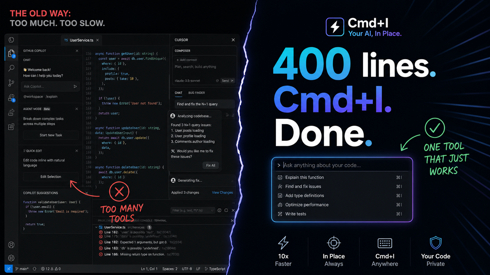
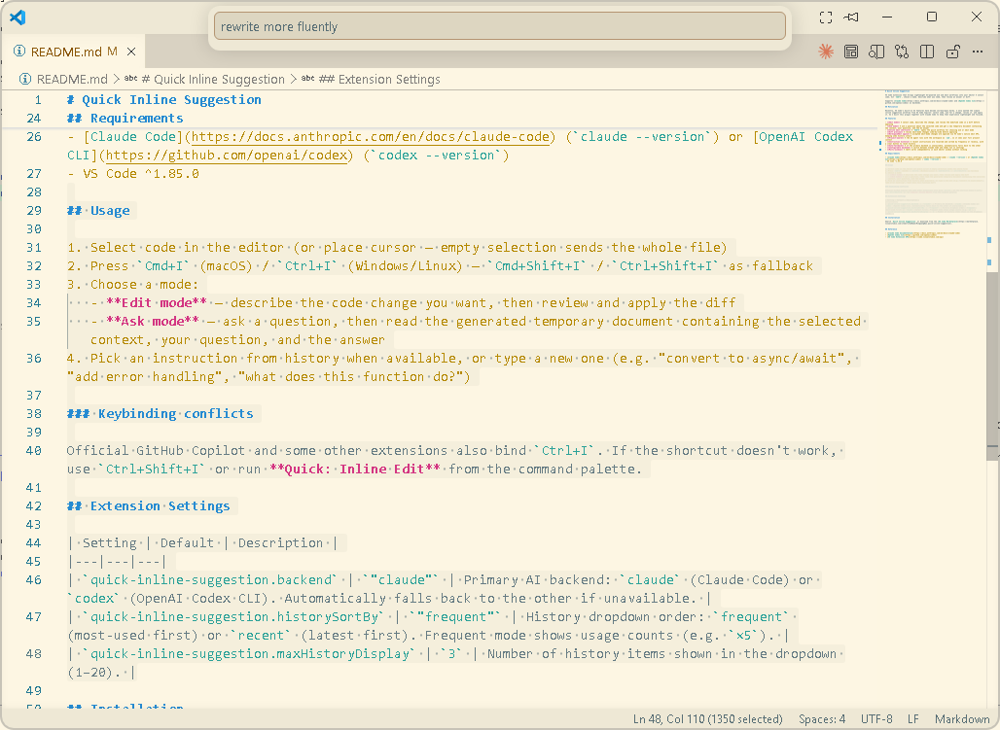
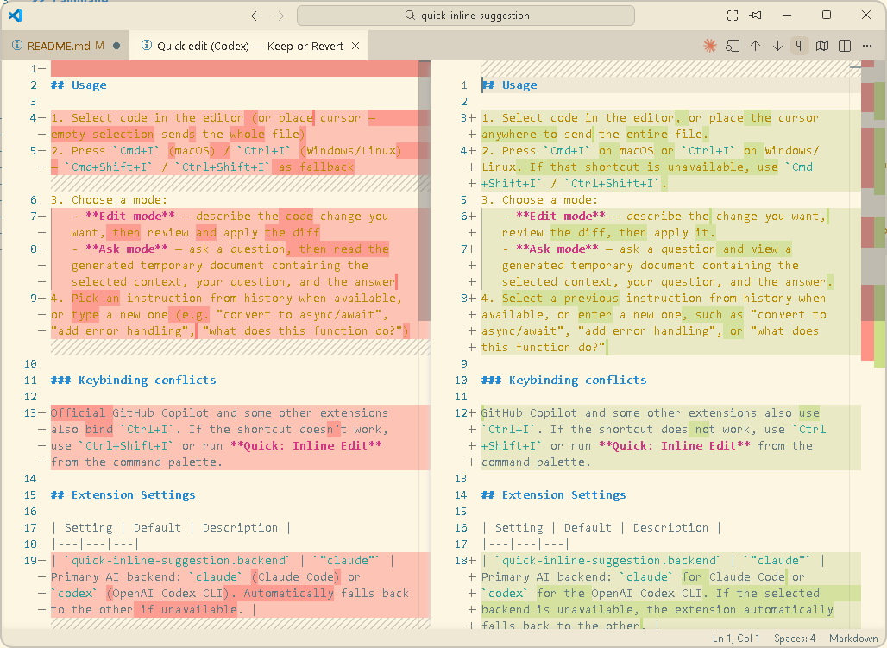
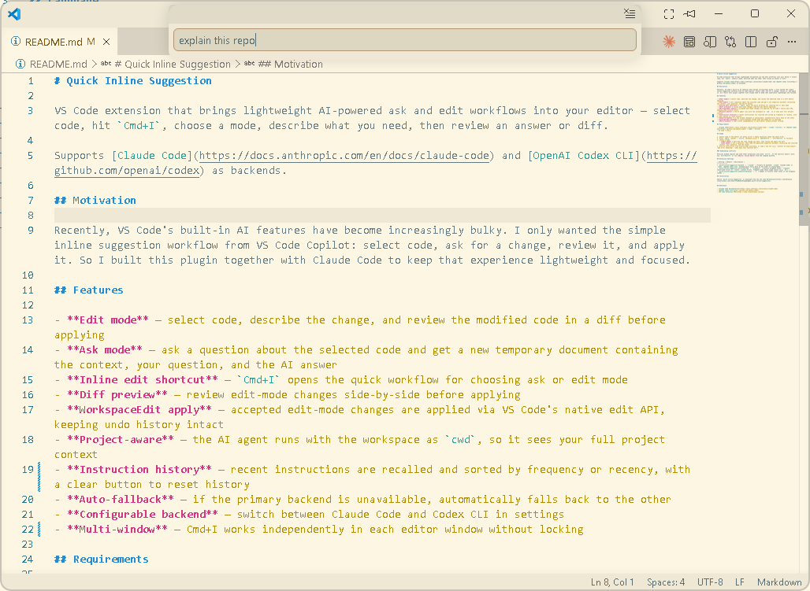
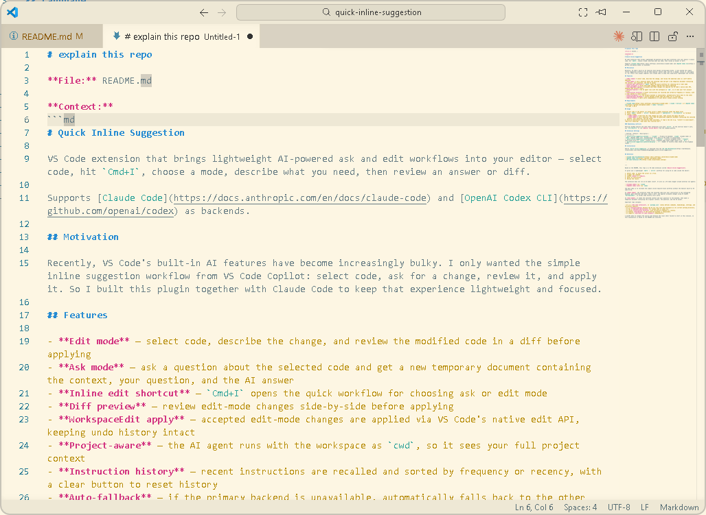

# Quick Inline Suggestion

VS Code extension that brings lightweight AI-powered ask and edit workflows into your editor — select code, hit `Cmd+I`, choose a mode, describe what you need, then review an answer or diff.

Supports [Claude Code](https://docs.anthropic.com/en/docs/claude-code) and [OpenAI Codex CLI](https://github.com/openai/codex) as backends.

## Motivation

Recently, VS Code's built-in AI features have become increasingly bulky. I only wanted the simple inline suggestion workflow from VS Code Copilot: select code, ask for a change, review it, and apply it. So I built this plugin together with Claude Code to keep that experience lightweight and focused.

## Features

- **Edit mode** — select code, describe the change, and review the modified code in a diff before applying
- **Ask mode** — ask a question about the selected code and get a new temporary document containing the context, your question, and the AI answer
- **Inline edit shortcut** — `Cmd+I` opens the quick workflow for choosing ask or edit mode
- **Diff preview** — review edit-mode changes side-by-side before applying
- **WorkspaceEdit apply** — accepted edit-mode changes are applied via VS Code's native edit API, keeping undo history intact
- **Project-aware** — the AI agent runs with the workspace as `cwd`, so it sees your full project context
- **Instruction history** — recent instructions are recalled and sorted by frequency or recency, with a clear button to reset history
- **Auto-fallback** — if the primary backend is unavailable, automatically falls back to the other
- **Configurable backend** — switch between Claude Code and Codex CLI in settings
- **Multi-window** — Cmd+I works independently in each editor window without locking

## Requirements

- [Claude Code](https://docs.anthropic.com/en/docs/claude-code) (`claude --version`) or [OpenAI Codex CLI](https://github.com/openai/codex) (`codex --version`)
- VS Code ^1.85.0

## Usage

1. Select code in the editor (or place cursor — empty selection sends the whole file)
2. Press `Cmd+I` (macOS) / `Ctrl+I` (Windows/Linux) — `Cmd+Shift+I` / `Ctrl+Shift+I` as fallback
3. Choose a mode:
   - **Edit mode** — describe the code change you want, then review and apply the diff
   - **Ask mode** — ask a question, then read the generated temporary document containing the selected context, your question, and the answer
4. Pick an instruction from history when available, or type a new one (e.g. "convert to async/await", "add error handling", "what does this function do?")

### Keybinding conflicts

Official GitHub Copilot and some other extensions also bind `Ctrl+I`. If the shortcut doesn't work, use `Ctrl+Shift+I` or run **Quick: Inline Edit** from the command palette.

## Screenshots

| Mode |                            Instruction                            |                                 Result                                 |
| :--- | :---------------------------------------------------------------: | :--------------------------------------------------------------------: |
| Edit |  |  |
| Ask  |    |   |

## Limitations

- **Not real inline/ghost-text completion** — unlike Copilot-style Tab completion, this extension is a manual, instruction-driven workflow: you select code, explicitly trigger it (`Cmd+I`), and describe what you want. There's no automatic as-you-type suggestion.
- **Latency** — each request spawns a full CLI agent process (`claude -p` / `codex exec`), which is slower than a dedicated completion model. Expect seconds, not milliseconds.

## Roadmap

- **Tab completion** — add true inline/ghost-text completion (accept with `Tab`) alongside the current instruction-driven workflow, for lightweight as-you-type suggestions.

## Extension Settings

| Setting                                     | Default      | Description                                                                                                                     |
| ------------------------------------------- | ------------ | ------------------------------------------------------------------------------------------------------------------------------- |
| `quick-inline-suggestion.backend`           | `"claude"`   | Primary AI backend: `claude` (Claude Code) or `codex` (OpenAI Codex CLI). Automatically falls back to the other if unavailable. |
| `quick-inline-suggestion.historySortBy`     | `"frequent"` | History dropdown order: `frequent` (most-used first) or `recent` (latest first). Frequent mode shows usage counts (e.g. `×5`).  |
| `quick-inline-suggestion.maxHistoryDisplay` | `3`          | Number of history items shown in the dropdown (1–20).                                                                           |

## Installation

Search `Quick Inline Suggestion` or download from the [VS Code Marketplace](https://marketplace.visualstudio.com/items?itemName=MingyangBao.quick-inline-suggestion).

## Reference

- [Claude Code documentation](https://docs.anthropic.com/en/docs/claude-code)
- [OpenAI Codex CLI](https://github.com/openai/codex)
- [VS Code Extension API](https://code.visualstudio.com/api)
- [Zhihu article](https://zhuanlan.zhihu.com/p/2042829304053109706)
- [WeChat article](https://mp.weixin.qq.com/s/3jmoiy4oRd_jeUH-7ZhQQg)
